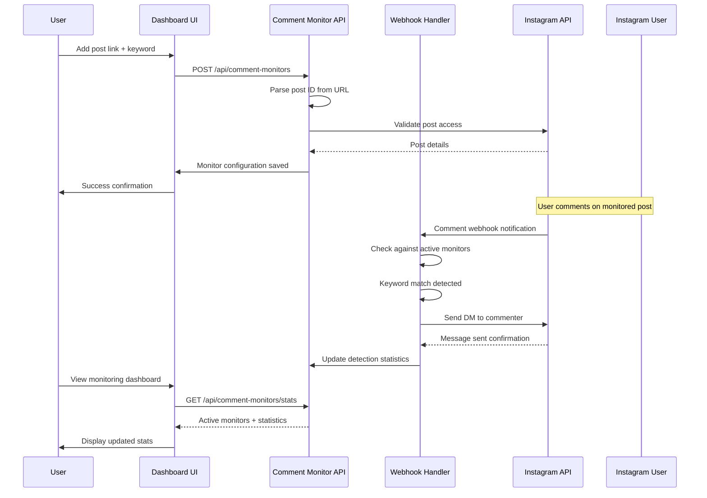

# Comment Notification UI Design

## Overview

This document outlines the design for a comment notification feature that enables users to monitor specific Instagram posts for keyword-based comments and automatically send direct messages to commenters. The feature extends the existing Instagram webhook integration with a user-friendly interface for managing post monitoring configurations.

### Feature Requirements
- User interface to add Instagram post links and associated keywords
- Real-time monitoring of comments on specified posts 
- Automatic DM sending when target keywords are detected in comments
- Management dashboard for active monitoring configurations
- Integration with existing webhook infrastructure

### Technology Stack Integration
- **Frontend**: Next.js 14 with App Router, React components, Tailwind CSS
- **UI Components**: Shadcn/ui component library (existing)
- **Backend**: Next.js API routes with Instagram Graph API integration
- **State Management**: React hooks with real-time updates
- **Styling**: Tailwind CSS with gradient themes (consistent with existing design)

## Architecture

### Component Architecture

```mermaid
graph TB
    subgraph "Frontend UI Layer"
        A[Main Dashboard Page] --> B[Comment Monitoring Section]
        B --> C[Add Post Form]
        B --> D[Active Monitors List]
        B --> E[Monitoring Stats Card]
    end
    
    subgraph "API Layer"
        F[/api/comment-monitors] --> G[CRUD Operations]
        H[/api/instagram/webhook] --> I[Comment Detection Logic]
        J[/api/comment-monitors/stats] --> K[Monitoring Statistics]
    end
    
    subgraph "Data Layer"
        L[In-Memory Storage] --> M[Monitor Configurations]
        L --> N[Detection History]
        L --> O[Statistics Cache]
    end
    
    subgraph "Instagram Integration"
        P[Instagram Graph API] --> Q[Post Comments API]
        P --> R[Send Message API]
        S[Webhook Events] --> T[Comment Notifications]
    end
    
    C --> F
    D --> F
    E --> J
    I --> P
    G --> L
    T --> I
    
    style A fill:#e1f5fe
    style B fill:#f3e5f5
    style F fill:#e8f5e8
    style P fill:#fff3e0
```

### Data Flow Architecture



## Component Design

### 1. Comment Monitoring Section Component

**Location**: Added to existing `src/app/page.tsx`
**Purpose**: Main interface for comment notification management

#### Component Structure
```typescript
interface CommentMonitor {
  id: string;
  postUrl: string;
  postId: string;
  keyword: string;
  isActive: boolean;
  createdAt: string;
  detectionCount: number;
  lastDetection?: string;
}

interface MonitoringStats {
  totalMonitors: number;
  activeMonitors: number;
  totalDetections: number;
  todayDetections: number;
}
```

#### UI Layout
- **Add Monitor Form**: Input fields for post URL and keyword with validation
- **Active Monitors Table**: List of configured monitors with status indicators
- **Quick Stats Cards**: Overview metrics for monitoring activity
- **Monitor Controls**: Enable/disable, edit, and delete options

### 2. Add Post Monitor Form

#### Form Fields
| Field | Type | Validation | Description |
|-------|------|------------|-------------|
| Post URL | Text Input | Instagram URL pattern | Full Instagram post URL |
| Keyword | Text Input | Required, 1-50 chars | Target keyword to monitor |
| Auto-Reply Message | Textarea | Optional, max 1000 chars | Custom DM message template |

#### Form Validation
- Post URL must be valid Instagram post format
- Keyword cannot be empty or contain special characters
- Auto-reply message follows Instagram character limits
- Duplicate post + keyword combinations prevented

#### Default Message Template
```
Hi! You commented "[keyword]" on my post. Thanks for engaging with my content!
```

### 3. Active Monitors Dashboard

#### Table Columns
| Column | Content | Actions |
|--------|---------|---------|
| Post Preview | Thumbnail + URL snippet | Click to view post |
| Keyword | Target keyword | Inline edit capability |
| Status | Active/Inactive badge | Toggle switch |
| Detections | Count + last detection time | View history link |
| Actions | Edit, Delete, Pause buttons | Confirmation dialogs |

#### Status Indicators
- **Active**: Green badge with pulse animation
- **Inactive**: Gray badge
- **Error**: Red badge with error tooltip
- **Pending**: Yellow badge for new monitors

### 4. Monitoring Statistics Cards

#### Overview Metrics
- **Total Monitors**: Count of all configured monitors
- **Active Monitors**: Currently enabled monitor count  
- **Today's Detections**: Comment matches found today
- **Success Rate**: Percentage of successful DM sends

#### Real-time Updates
- Auto-refresh every 30 seconds
- Manual refresh button
- Live status indicators for active monitoring

## API Design

### Comment Monitors API Endpoints

#### Create Monitor
```http
POST /api/comment-monitors
Content-Type: application/json

{
  "postUrl": "https://www.instagram.com/p/ABC123/",
  "keyword": "giveaway",
  "autoReplyMessage": "Thanks for participating in our giveaway!"
}
```

#### List Monitors
```http
GET /api/comment-monitors
Response: {
  "monitors": CommentMonitor[],
  "total": number
}
```

#### Update Monitor
```http
PUT /api/comment-monitors/{id}
Content-Type: application/json

{
  "keyword": "contest",
  "isActive": true,
  "autoReplyMessage": "Updated message"
}
```

#### Delete Monitor
```http
DELETE /api/comment-monitors/{id}
Response: { "success": boolean }
```

#### Get Statistics
```http
GET /api/comment-monitors/stats
Response: MonitoringStats
```

### Webhook Integration Enhancement

#### Comment Detection Logic
```typescript
// Enhanced webhook handler for comment monitoring
async function handleCommentEvent(commentEvent: InstagramComment) {
  const activeMonitors = await getActiveMonitors();
  
  for (const monitor of activeMonitors) {
    if (commentEvent.media_id === monitor.postId) {
      const commentText = commentEvent.text.toLowerCase();
      const keyword = monitor.keyword.toLowerCase();
      
      if (commentText.includes(keyword)) {
        await sendNotificationDM(
          commentEvent.from.id,
          monitor.autoReplyMessage || getDefaultMessage(keyword)
        );
        await updateDetectionStats(monitor.id);
      }
    }
  }
}
```

## UI Design Specifications

### Layout Integration
The comment monitoring section integrates into the existing dashboard page layout after the current status cards section.

```markdown
## Existing Layout Structure
1. Header with gradient title
2. Error alerts section  
3. Status cards grid (Instagram Account, Webhook, Auto Reply)
4. **NEW: Comment Monitoring Section** ← Insert here
5. Setup instructions card
6. Webhook configuration card
```

### Visual Design Elements

#### Color Scheme (Consistent with existing theme)
- **Primary**: Purple-blue gradient (`from-purple-600 to-blue-600`)
- **Success**: Green (`bg-green-500`, `text-green-700`)
- **Warning**: Yellow (`bg-yellow-50`, `border-yellow-200`)
- **Error**: Red (`bg-red-50`, `text-red-700`)
- **Cards**: White background with subtle shadows

#### Component Styling
- **Form Inputs**: Rounded borders with focus states
- **Buttons**: Consistent with existing button variants
- **Tables**: Striped rows with hover effects
- **Badges**: Rounded with appropriate status colors
- **Cards**: Consistent padding and border radius

### Responsive Design
- **Desktop**: Two-column layout for form and monitors list
- **Tablet**: Single column with stacked sections
- **Mobile**: Compressed table view with horizontal scroll

## State Management

### React State Structure
```typescript
// Main component state
const [monitors, setMonitors] = useState<CommentMonitor[]>([]);
const [stats, setStats] = useState<MonitoringStats | null>(null);
const [isLoading, setIsLoading] = useState(false);
const [error, setError] = useState<string | null>(null);

// Form state
const [newMonitor, setNewMonitor] = useState({
  postUrl: '',
  keyword: '',
  autoReplyMessage: ''
});
```

### Data Fetching Patterns
- **Initial Load**: Fetch monitors and stats on component mount
- **Real-time Updates**: Poll for stats every 30 seconds
- **Optimistic Updates**: Update UI immediately on user actions
- **Error Handling**: Display user-friendly error messages

## Testing Strategy

### Component Testing
- **Form Validation**: Test URL parsing and keyword validation
- **CRUD Operations**: Test add, edit, delete monitor workflows  
- **Real-time Updates**: Mock polling and state updates
- **Error Scenarios**: Test API failures and network errors

### Integration Testing
- **Webhook Flow**: Test comment detection and DM sending
- **API Endpoints**: Test all CRUD operations with various inputs
- **Instagram API**: Test post validation and message sending
- **Performance**: Test with multiple active monitors

### User Acceptance Testing
- **User Journey**: Complete workflow from adding monitor to receiving DM
- **Edge Cases**: Invalid URLs, non-existent posts, API limits
- **Mobile Experience**: Test responsive design on various devices
- **Accessibility**: Test keyboard navigation and screen readers

## Implementation Phases

### Phase 1: Core UI Components (Week 1)
- Add comment monitoring section to main page
- Implement add monitor form with validation
- Create monitors list with basic CRUD operations
- Add monitoring statistics cards

### Phase 2: API Integration (Week 2)  
- Develop comment monitors API endpoints
- Implement data persistence layer
- Integrate with existing Instagram API client
- Add error handling and validation

### Phase 3: Webhook Enhancement (Week 3)
- Extend webhook handler for comment events
- Implement keyword detection logic
- Add DM sending functionality
- Update statistics tracking

### Phase 4: Polish & Testing (Week 4)
- Responsive design refinements
- Comprehensive testing suite
- Performance optimizations
- Documentation and deployment

## Security Considerations

### Data Protection
- **Input Sanitization**: Validate and sanitize all user inputs
- **Rate Limiting**: Prevent abuse of monitor creation
- **Access Control**: Ensure users can only access their monitors
- **Data Storage**: Implement secure data handling practices

### Instagram API Compliance
- **Rate Limits**: Respect Instagram API rate limiting
- **Webhook Verification**: Maintain signature verification
- **User Privacy**: Handle user data according to Meta policies
- **Content Policies**: Ensure auto-replies comply with Instagram rules

### Error Handling
- **Graceful Degradation**: Handle API failures gracefully
- **User Feedback**: Provide clear error messages
- **Logging**: Log errors for debugging without exposing sensitive data
- **Recovery**: Implement retry mechanisms for transient failures