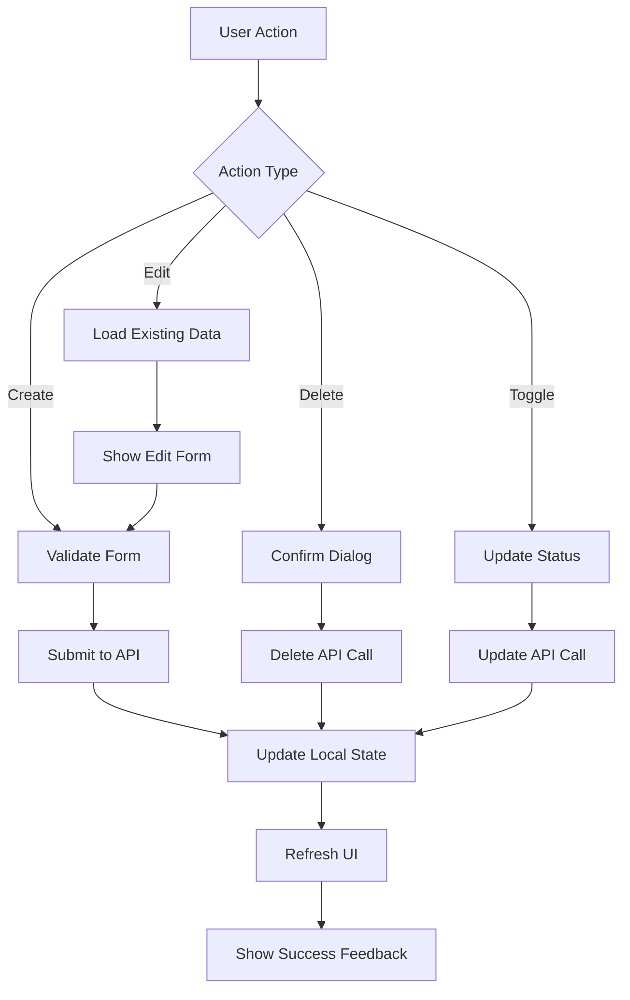
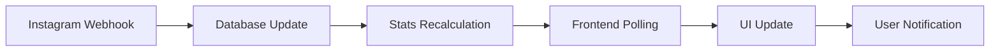

# Dashboard UI Improvement Design

## Overview

This design document outlines the improvement of the AI Instagram Content Moderation dashboard interface. The current system is fully functional with database integration using Supabase and Prisma, but requires a modern, clean, and intuitive user interface using shadcn/ui components to enhance user experience and operational efficiency.

## Technology Stack & Dependencies

### Core Technologies
- **Frontend Framework**: Next.js 15.5.0 with App Router
- **UI Component Library**: shadcn/ui (already configured)
- **Styling**: Tailwind CSS with utility-first approach
- **Type System**: TypeScript for type safety
- **State Management**: React hooks (useState, useEffect)
- **Database**: Supabase with Prisma ORM
- **Build Tool**: Turbopack (Next.js)

### Existing shadcn/ui Components Available
- Layout: Card, Separator, Sheet, Sidebar
- Forms: Input, Textarea, Label, Button, Checkbox, Select
- Data Display: Table, Badge, Alert, Progress, Charts
- Navigation: Tabs, Breadcrumb, Pagination
- Feedback: Alert Dialog, Dialog, Tooltip, Sonner (Toast)
- Overlays: Popover, Hover Card, Dropdown Menu

## Component Architecture

### Current Issues with Existing UI
1. **Poor Visual Hierarchy**: Lack of proper spacing and typography scale
2. **Inconsistent Layout**: Mixed component sizes and alignment
3. **Limited Data Visualization**: Basic tables without advanced filtering
4. **Poor Mobile Responsiveness**: Layout breaks on smaller screens
5. **Lack of Interactive Feedback**: Missing loading states and animations
6. **Inefficient Space Utilization**: Cards too large, wasted whitespace
7. **No Dark Mode Support**: Single theme implementation

### Proposed Component Hierarchy

```
Dashboard Layout
├── Header Section
│   ├── Logo & Title Component
│   ├── Theme Toggle Component
│   └── User Actions Component
├── Overview Section
│   ├── Statistics Cards Grid
│   │   ├── Total Monitors Card
│   │   ├── Active Monitors Card
│   │   ├── Total Detections Card
│   │   └── Today's Activity Card
│   └── Quick Actions Panel
├── System Status Section
│   ├── Instagram Connection Status
│   ├── Webhook Status Indicator
│   └── Database Health Check
├── Monitor Management Section
│   ├── Monitor Creation Form
│   │   ├── Post URL Input with Validation
│   │   ├── Keyword Management
│   │   └── Auto-Reply Template Editor
│   ├── Active Monitors Table
│   │   ├── Advanced Filtering
│   │   ├── Bulk Actions
│   │   └── Real-time Status Updates
│   └── Monitor Analytics Charts
└── Activity Feed Section
    ├── Recent Detections Timeline
    ├── System Logs Viewer
    └── Performance Metrics
```

### Component Definitions

#### Header Component
```typescript
interface HeaderProps {
  title: string;
  subtitle?: string;
  actions?: React.ReactNode;
  showThemeToggle?: boolean;
}
```

**Features:**
- Responsive logo and branding
- Theme toggle (light/dark mode)
- Breadcrumb navigation
- User profile dropdown

#### Statistics Card Component
```typescript
interface StatCardProps {
  title: string;
  value: string | number;
  trend?: {
    value: number;
    direction: 'up' | 'down' | 'neutral';
    period: string;
  };
  icon: React.ComponentType;
  color: 'blue' | 'green' | 'purple' | 'orange' | 'red';
  loading?: boolean;
}
```

**Features:**
- Skeleton loading states
- Trend indicators with color coding
- Hover animations
- Click actions for drill-down

#### Monitor Management Table Component
```typescript
interface MonitorTableProps {
  monitors: CommentMonitor[];
  onEdit: (id: string) => void;
  onDelete: (id: string) => void;
  onToggleStatus: (id: string, status: boolean) => void;
  loading?: boolean;
  pagination?: PaginationConfig;
  filters?: FilterConfig;
}
```

**Features:**
- Advanced search and filtering
- Sortable columns
- Bulk operations
- Inline editing capabilities
- Real-time status indicators

#### Monitor Creation Form Component
```typescript
interface MonitorFormProps {
  onSubmit: (data: MonitorFormData) => Promise<void>;
  initialData?: Partial<MonitorFormData>;
  mode: 'create' | 'edit';
}

interface MonitorFormData {
  postUrl: string;
  keyword: string;
  autoReplyMessage: string;
  isActive: boolean;
}
```

**Features:**
- Real-time validation
- Instagram URL preview
- Template suggestions
- Auto-save drafts

## Routing & Navigation

### Navigation Structure
```
/ (Dashboard Home)
├── /monitors (Monitor Management)
│   ├── /monitors/new (Create Monitor)
│   └── /monitors/[id] (Edit Monitor)
├── /analytics (Performance Analytics)
├── /logs (System Logs)
├── /settings (Configuration)
└── /help (Documentation)
```

### Sidebar Navigation Component
```typescript
interface SidebarItem {
  label: string;
  href: string;
  icon: React.ComponentType;
  badge?: number;
  children?: SidebarItem[];
}
```

## Styling Strategy

### Design System Tokens

#### Color Palette
```typescript
const colors = {
  primary: {
    50: '#eff6ff',
    500: '#3b82f6',
    600: '#2563eb',
    900: '#1e3a8a'
  },
  success: {
    50: '#f0fdf4',
    500: '#22c55e',
    600: '#16a34a'
  },
  warning: {
    50: '#fffbeb',
    500: '#f59e0b',
    600: '#d97706'
  },
  danger: {
    50: '#fef2f2',
    500: '#ef4444',
    600: '#dc2626'
  }
}
```

#### Typography Scale
```typescript
const typography = {
  h1: 'text-3xl font-bold tracking-tight',
  h2: 'text-2xl font-semibold tracking-tight',
  h3: 'text-xl font-medium',
  body: 'text-sm',
  caption: 'text-xs text-muted-foreground'
}
```

#### Spacing System
```typescript
const spacing = {
  xs: '0.5rem',
  sm: '0.75rem',
  md: '1rem',
  lg: '1.5rem',
  xl: '2rem',
  '2xl': '3rem'
}
```

### Component Styling Patterns

#### Card Styling
- Consistent border radius: `rounded-lg`
- Shadow hierarchy: `shadow-sm` for subtle elevation
- Padding consistency: `p-6` for content areas
- Border treatment: `border border-border`

#### Interactive Elements
- Hover states: `hover:bg-accent hover:text-accent-foreground`
- Focus states: `focus-visible:outline-none focus-visible:ring-2`
- Transition smoothness: `transition-colors duration-200`
- Active states: `active:scale-95`

## State Management

### Global State Architecture
```typescript
interface DashboardState {
  monitors: CommentMonitor[];
  stats: MonitoringStats;
  systemStatus: SystemStatus;
  ui: UIState;
}

interface UIState {
  loading: {
    monitors: boolean;
    stats: boolean;
    systemStatus: boolean;
  };
  errors: {
    monitors?: string;
    stats?: string;
    systemStatus?: string;
  };
  filters: MonitorFilters;
  pagination: PaginationState;
}
```

### Data Fetching Patterns
```typescript
// Custom hooks for data management
const useMonitors = () => {
  const [monitors, setMonitors] = useState<CommentMonitor[]>([]);
  const [loading, setLoading] = useState(false);
  const [error, setError] = useState<string | null>(null);

  const fetchMonitors = useCallback(async () => {
    // Implementation
  }, []);

  const createMonitor = useCallback(async (data: MonitorFormData) => {
    // Implementation
  }, []);

  return { monitors, loading, error, fetchMonitors, createMonitor };
};
```

### Real-time Updates
```typescript
// WebSocket or polling for real-time updates
const useRealTimeStats = () => {
  useEffect(() => {
    const interval = setInterval(async () => {
      // Fetch latest stats
    }, 30000); // Update every 30 seconds

    return () => clearInterval(interval);
  }, []);
};
```

## API Integration Layer

### API Client Structure
```typescript
class ApiClient {
  private baseUrl: string = '/api';

  async getMonitors(filters?: MonitorFilters): Promise<CommentMonitor[]> {
    // Implementation
  }

  async createMonitor(data: MonitorFormData): Promise<CommentMonitor> {
    // Implementation
  }

  async updateMonitor(id: string, data: Partial<MonitorFormData>): Promise<CommentMonitor> {
    // Implementation
  }

  async deleteMonitor(id: string): Promise<void> {
    // Implementation
  }

  async getStats(): Promise<MonitoringStats> {
    // Implementation
  }
}
```

### Error Handling Strategy
```typescript
interface ApiError {
  message: string;
  code: string;
  details?: Record<string, any>;
}

const handleApiError = (error: ApiError) => {
  // Toast notifications for user feedback
  // Logging for debugging
  // Fallback UI states
};
```

## Data Flow Architecture

### Monitor Management Flow


### Real-time Data Updates


## Performance Optimizations

### Component Optimization
- **Memoization**: Use `React.memo` for expensive components
- **Code Splitting**: Lazy load heavy components
- **Virtual Scrolling**: For large monitor lists
- **Debounced Search**: Prevent excessive API calls

### Data Optimization
- **Pagination**: Limit data fetching to required items
- **Caching**: Client-side caching with SWR or React Query
- **Optimistic Updates**: Immediate UI feedback
- **Background Sync**: Periodic data synchronization

### Bundle Optimization
- **Tree Shaking**: Remove unused shadcn components
- **Dynamic Imports**: Load components on demand
- **Image Optimization**: Use Next.js Image component
- **Font Optimization**: Preload critical fonts

## Responsive Design Strategy

### Breakpoint System
```typescript
const breakpoints = {
  sm: '640px',
  md: '768px',
  lg: '1024px',
  xl: '1280px',
  '2xl': '1536px'
}
```

### Mobile-First Approach
- **Collapsible Sidebar**: Drawer on mobile, fixed on desktop
- **Responsive Tables**: Horizontal scroll with sticky columns
- **Touch-Friendly**: Larger tap targets for mobile
- **Progressive Enhancement**: Core functionality works without JavaScript

### Layout Adaptations
- **Grid Systems**: CSS Grid for complex layouts
- **Flexbox**: For component alignment
- **Container Queries**: Component-level responsiveness
- **Responsive Typography**: Fluid font sizes

## Accessibility Implementation

### WCAG 2.1 Compliance
- **Keyboard Navigation**: All interactive elements accessible via keyboard
- **Screen Reader Support**: Proper ARIA labels and landmarks
- **Color Contrast**: Minimum 4.5:1 ratio for text
- **Focus Management**: Clear focus indicators

### Accessibility Features
```typescript
interface AccessibilityProps {
  'aria-label'?: string;
  'aria-describedby'?: string;
  'role'?: string;
  'tabIndex'?: number;
}
```

## Testing Strategy

### Unit Testing
- **Component Testing**: Jest + React Testing Library
- **Hook Testing**: Custom hook testing utilities
- **Utility Testing**: Pure function testing
- **API Testing**: Mock API responses

### Integration Testing
- **User Flow Testing**: Complete user journeys
- **API Integration**: End-to-end API testing
- **Cross-browser Testing**: Major browser compatibility
- **Accessibility Testing**: Automated accessibility checks

### Performance Testing
- **Bundle Analysis**: Webpack bundle analyzer
- **Lighthouse Audits**: Performance metrics
- **Load Testing**: API endpoint performance
- **Memory Usage**: Component memory leaks

## Security Considerations

### Client-Side Security
- **Input Validation**: Client and server-side validation
- **XSS Prevention**: Sanitize user inputs
- **CSRF Protection**: Token-based protection
- **Content Security Policy**: Strict CSP headers

### Data Protection
- **Sensitive Data**: No sensitive data in client state
- **Local Storage**: Encrypt stored data
- **API Keys**: Server-side only
- **Error Handling**: No sensitive data in error messages