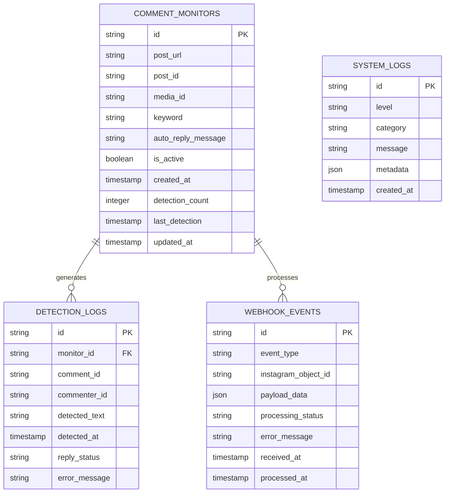
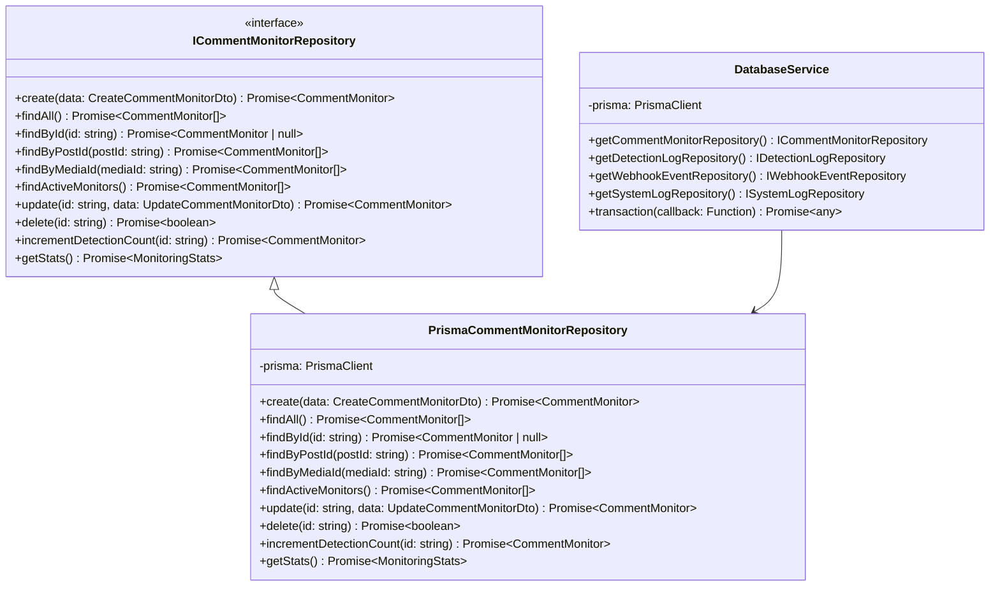
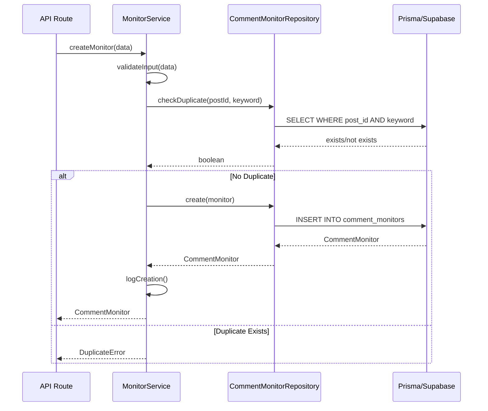
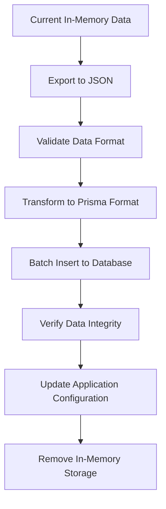

# Database Integration Design

## Overview

This design document outlines the migration from in-memory storage to persistent database storage using Supabase as the database provider and Prisma as the ORM. The system currently stores comment monitors, statistics, and related data in memory, which needs to be replaced with scalable database operations for production deployment.

## Technology Stack & Dependencies

### Core Database Technologies
- **Database Provider**: Supabase (PostgreSQL-based)
- **ORM**: Prisma Client with TypeScript support
- **Connection Management**: Prisma connection pooling
- **Migration Management**: Prisma Migrate

### New Dependencies
```json
{
  "dependencies": {
    "@prisma/client": "^5.21.0",
    "@supabase/supabase-js": "^2.48.0"
  },
  "devDependencies": {
    "prisma": "^5.21.0"
  }
}
```

## Database Schema Design

### Core Tables Structure



### Prisma Schema Definition

```prisma
generator client {
  provider = "prisma-client-js"
}

datasource db {
  provider = "postgresql"
  url      = env("DATABASE_URL")
}

model CommentMonitor {
  id                String   @id @default(cuid())
  postUrl           String   @map("post_url")
  postId            String   @map("post_id")
  mediaId           String?  @map("media_id")
  keyword           String
  autoReplyMessage  String   @map("auto_reply_message")
  isActive          Boolean  @map("is_active") @default(true)
  createdAt         DateTime @map("created_at") @default(now())
  detectionCount    Int      @map("detection_count") @default(0)
  lastDetection     DateTime? @map("last_detection")
  updatedAt         DateTime @map("updated_at") @updatedAt

  detectionLogs DetectionLog[]
  
  @@unique([postId, keyword])
  @@map("comment_monitors")
}

model DetectionLog {
  id           String   @id @default(cuid())
  monitorId    String   @map("monitor_id")
  commentId    String   @map("comment_id")
  commenterId  String   @map("commenter_id")
  detectedText String   @map("detected_text")
  detectedAt   DateTime @map("detected_at") @default(now())
  replyStatus  String   @map("reply_status") @default("pending")
  errorMessage String?  @map("error_message")

  monitor CommentMonitor @relation(fields: [monitorId], references: [id], onDelete: Cascade)
  
  @@map("detection_logs")
}

model WebhookEvent {
  id               String    @id @default(cuid())
  eventType        String    @map("event_type")
  instagramObjectId String   @map("instagram_object_id")
  payloadData      Json      @map("payload_data")
  processingStatus String    @map("processing_status") @default("pending")
  errorMessage     String?   @map("error_message")
  receivedAt       DateTime  @map("received_at") @default(now())
  processedAt      DateTime? @map("processed_at")
  
  @@map("webhook_events")
}

model SystemLog {
  id        String   @id @default(cuid())
  level     String
  category  String
  message   String
  metadata  Json?
  createdAt DateTime @map("created_at") @default(now())
  
  @@map("system_logs")
}
```

## Data Access Layer Architecture

### Repository Pattern Implementation



### Service Layer Integration



## Migration Strategy

### Phase 1: Database Setup
1. **Supabase Project Configuration**
   - Create Supabase project
   - Configure database URL and connection strings
   - Set up environment variables

2. **Prisma Installation & Configuration**
   - Install Prisma dependencies
   - Initialize Prisma schema
   - Configure database connection

3. **Schema Migration**
   - Run initial migration to create tables
   - Set up indexes for performance optimization

### Phase 2: Repository Implementation
1. **Core Repository Interfaces**
   - Define repository contracts
   - Implement Prisma-based repositories
   - Add transaction support

2. **Data Transfer Layer**
   - Create DTOs for type safety
   - Implement data validation
   - Add error handling

### Phase 3: Service Layer Migration
1. **Replace Storage Dependencies**
   - Update services to use repositories
   - Maintain existing API contracts
   - Add database transaction support

2. **API Route Updates**
   - Replace in-memory storage calls
   - Update error handling
   - Add proper validation

### Phase 4: Enhanced Features
1. **Audit Logging**
   - Implement detection log tracking
   - Add webhook event persistence
   - Create system log management

2. **Performance Optimization**
   - Add database indexes
   - Implement connection pooling
   - Add query optimization

## File Structure Changes

### New Database Files
```
src/
├── lib/
│   ├── database/
│   │   ├── index.ts                 # Prisma client instance
│   │   ├── repositories/
│   │   │   ├── comment-monitor.repository.ts
│   │   │   ├── detection-log.repository.ts
│   │   │   ├── webhook-event.repository.ts
│   │   │   └── system-log.repository.ts
│   │   ├── services/
│   │   │   ├── monitor.service.ts
│   │   │   ├── detection.service.ts
│   │   │   └── webhook.service.ts
│   │   └── types/
│   │       ├── dto.ts              # Data Transfer Objects
│   │       └── repository.ts       # Repository interfaces
│   └── utils/
│       └── database-logger.ts      # Database-aware logging
├── prisma/
│   ├── schema.prisma              # Database schema
│   ├── migrations/                # Migration files
│   └── seed.ts                    # Database seeding
```

### Modified Files
- `src/lib/comment-monitor-storage.ts` → **Deprecated/Removed**
- `src/app/api/comment-monitors/route.ts` → **Updated to use services**
- `src/app/api/comment-monitors/[id]/route.ts` → **Updated to use services**
- `src/app/api/comment-monitors/stats/route.ts` → **Updated to use services**
- `src/app/api/instagram/webhook/route.ts` → **Updated to use services**

## API Layer Updates

### Repository Integration Pattern

```typescript
// Before (In-Memory)
import storage from '@/lib/comment-monitor-storage';
const monitors = storage.getAllMonitors();

// After (Database)
import { DatabaseService } from '@/lib/database';
const db = new DatabaseService();
const monitors = await db.getCommentMonitorRepository().findAll();
```

### Error Handling Enhancement

```typescript
// Database-Aware Error Handling
try {
  const monitor = await monitorService.createMonitor(data);
  return Response.json({ success: true, monitor });
} catch (error) {
  if (error instanceof PrismaClientKnownRequestError) {
    if (error.code === 'P2002') {
      return Response.json(
        { success: false, error: 'Duplicate monitor exists' },
        { status: 409 }
      );
    }
  }
  
  logger.error('Database operation failed', 'DATABASE', { error });
  return Response.json(
    { success: false, error: 'Internal server error' },
    { status: 500 }
  );
}
```

## Data Migration Process

### Migration Utilities



### Migration Script Structure
1. **Data Export**: Extract current in-memory data
2. **Data Transformation**: Convert to database-compatible format
3. **Batch Import**: Efficiently insert data using Prisma
4. **Verification**: Ensure data integrity and completeness
5. **Rollback Support**: Maintain backup for rollback scenarios

## Performance Considerations

### Database Optimization
- **Indexing Strategy**: Index on frequently queried fields (post_id, keyword, is_active)
- **Connection Pooling**: Optimize database connections for concurrent requests
- **Query Optimization**: Use Prisma's query optimization features

### Caching Strategy
- **Redis Integration**: Optional caching layer for frequently accessed data
- **Application-Level Caching**: Cache monitoring statistics and recent activity
- **Database Query Caching**: Utilize Prisma query caching

## Security & Compliance

### Data Protection
- **Environment Variables**: Secure storage of database credentials
- **Connection Encryption**: SSL/TLS for database connections
- **Access Control**: Role-based database access through Supabase RLS

### Audit Trail
- **Change Tracking**: Log all CRUD operations with timestamps
- **User Attribution**: Track which operations modify data
- **Compliance Logging**: Maintain logs for regulatory requirements

## Testing Strategy

### Unit Testing
- **Repository Testing**: Mock Prisma client for isolated testing
- **Service Testing**: Test business logic with repository mocks
- **Integration Testing**: Test with actual database using test containers

### Database Testing
- **Migration Testing**: Verify schema migrations work correctly
- **Seed Data Testing**: Ensure seed scripts create valid test data
- **Performance Testing**: Verify query performance under load

## Monitoring & Observability

### Database Monitoring
- **Connection Pool Metrics**: Monitor database connection usage
- **Query Performance**: Track slow queries and optimization opportunities
- **Error Rate Monitoring**: Monitor database operation failure rates

### Application Metrics
- **API Response Times**: Monitor database operation impact on API performance
- **Resource Usage**: Track memory and CPU usage changes
- **Data Growth**: Monitor database size and growth patterns