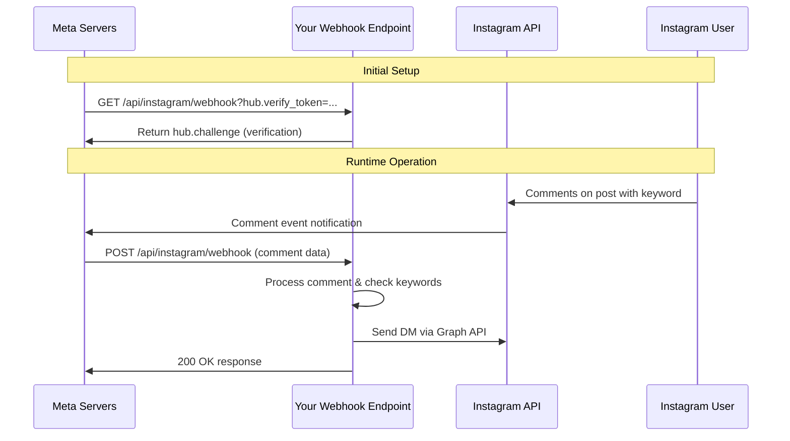

# Instagram Webhook System Documentation

## Table of Contents
1. [Overview](#overview)
2. [How Webhooks Work in Next.js](#how-webhooks-work-in-nextjs)
3. [Instagram Webhook Integration](#instagram-webhook-integration)
4. [System Architecture](#system-architecture)
5. [Webhook Flow Detailed](#webhook-flow-detailed)
6. [API Routes Explained](#api-routes-explained)
7. [Security Implementation](#security-implementation)
8. [Comment Monitoring System](#comment-monitoring-system)
9. [Error Handling & Logging](#error-handling--logging)
10. [Testing & Development](#testing--development)
11. [Troubleshooting](#troubleshooting)

## Overview

This Instagram Content Moderation system uses webhooks to automatically monitor Instagram posts for specific keywords and send automated DMs to users who comment with those keywords. The system is built on Next.js with a sophisticated webhook infrastructure that handles real-time Instagram events.

### Key Features
- **Real-time Comment Monitoring**: Detects keywords in Instagram comments instantly
- **Automated DM Responses**: Sends personalized direct messages to commenters
- **Comprehensive Logging**: Tracks all activities for auditing and debugging
- **Secure Webhook Verification**: Validates incoming requests from Meta's servers
- **Development-friendly Testing**: Includes endpoints for testing and validation

## How Webhooks Work in Next.js

### Next.js API Routes as Webhook Endpoints

In Next.js 13+ with the App Router, webhooks are implemented as API routes using the file-based routing system:

```
src/app/api/
├── instagram/
│   └── webhook/
│       └── route.ts        # Main webhook endpoint
├── test/
│   └── route.ts           # Testing endpoint
├── logs/
│   └── route.ts           # Logging endpoint
└── comment-monitors/
    └── route.ts           # Monitor management
```

### HTTP Methods Handling

Each `route.ts` file exports named functions for different HTTP methods:

```typescript
// GET - Webhook verification (required by Meta)
export async function GET(request: NextRequest) {
  // Handle webhook subscription verification
}

// POST - Process incoming webhook events
export async function POST(request: NextRequest) {
  // Handle Instagram messages and comments
}
```

### Request Processing Pipeline

1. **Request Reception**: Next.js receives the webhook request
2. **Route Matching**: Routes to the appropriate API endpoint
3. **Method Handling**: Calls the corresponding HTTP method function
4. **Processing**: Executes business logic
5. **Response**: Returns appropriate HTTP response

## Instagram Webhook Integration

### Meta Webhook Setup

The Instagram webhook integration follows Meta's webhook protocol:



### Webhook Event Types

The system handles two main Instagram webhook events:

1. **Message Events** (`messaging`): Direct messages sent to your Instagram account
2. **Comment Events** (`changes` with `field: "comments"`): Comments on your Instagram posts

## System Architecture

```mermaid
graph TB
    subgraph "External Services"
        A[Meta Webhook Servers]
        B[Instagram Graph API]
    end
    
    subgraph "Next.js Application"
        C[Webhook Route /api/instagram/webhook]
        D[Comment Monitor Storage]
        E[Instagram API Client]
        F[Logger System]
        G[Test Endpoints]
        H[Monitoring Dashboard]
    end
    
    subgraph "Supporting APIs"
        I[/api/comment-monitors]
        J[/api/test]
        K[/api/logs]
        L[/api/link-media-id]
        M[/api/test-post-validation]
    end
    
    A -->|POST webhook events| C
    C --> D
    C --> E
    C --> F
    E -->|Send DMs| B
    
    I --> D
    J --> E
    K --> F
    L --> D
    M --> D
    
    H --> I
    H --> J
    H --> K
```

### Core Components

1. **Webhook Handler** (`route.ts`): Main entry point for Instagram events
2. **Comment Monitor Storage** (`comment-monitor-storage.ts`): Manages keyword monitoring rules
3. **Instagram API Client** (`instagram-api.ts`): Handles communication with Instagram Graph API
4. **Logger System** (`logger.ts`): Comprehensive logging and monitoring
5. **Supporting API Routes**: Various endpoints for testing and management

## Webhook Flow Detailed

### 1. Webhook Verification (GET Request)

When you register your webhook URL with Meta, they send a verification request:

```typescript
export async function GET(request: NextRequest) {
  const searchParams = request.nextUrl.searchParams;
  const mode = searchParams.get('hub.mode');
  const token = searchParams.get('hub.verify_token');
  const challenge = searchParams.get('hub.challenge');

  if (mode === 'subscribe' && token === process.env.WEBHOOK_VERIFY_TOKEN) {
    // Return the challenge to verify webhook
    return new NextResponse(challenge, { status: 200 });
  } else {
    return new NextResponse('Forbidden', { status: 403 });
  }
}
```

### 2. Event Processing (POST Request)

When Instagram events occur, Meta sends POST requests with event data:

```typescript
export async function POST(request: NextRequest) {
  // 1. Get request body and signature
  const body = await request.text();
  const signature = request.headers.get('x-hub-signature-256');
  
  // 2. Verify request authenticity
  if (!verifySignature(body, signature)) {
    return new NextResponse('Unauthorized', { status: 401 });
  }
  
  // 3. Parse webhook payload
  const payload: InstagramWebhookPayload = JSON.parse(body);
  
  // 4. Process different event types
  for (const entry of payload.entry) {
    // Handle direct messages
    if (entry.messaging) {
      for (const messaging of entry.messaging) {
        await handleMessage(messaging);
      }
    }
    
    // Handle comment events
    if (entry.changes) {
      for (const change of entry.changes) {
        if (change.field === 'comments') {
          await handleComment(change);
        }
      }
    }
  }
  
  return new NextResponse('OK', { status: 200 });
}
```

### 3. Comment Processing Flow

```mermaid
flowchart TD
    A[Instagram Comment Event] --> B[Extract Comment Data]
    B --> C[Get Media ID & Comment Text]
    C --> D[Find Relevant Monitors]
    D --> E{Monitors Found?}
    E -->|No| F[Log: No monitors for this post]
    E -->|Yes| G[Check Each Monitor]
    G --> H{Keyword Match?}
    H -->|No| I[Continue to next monitor]
    H -->|Yes| J[Generate DM Message]
    J --> K[Replace [keyword] placeholder]
    K --> L[Send DM to Commenter]
    L --> M[Update Detection Stats]
    M --> N[Log Success]
    I --> H
    F --> O[End]
    N --> O
```

## API Routes Explained

### 1. Main Webhook Route (`/api/instagram/webhook/route.ts`)

**Purpose**: Primary endpoint for receiving Instagram webhook events

**Key Functions**:
- `GET`: Webhook verification for Meta subscription
- `POST`: Process Instagram messages and comments
- `verifySignature()`: Validates request authenticity
- `handleMessage()`: Processes direct messages
- `handleComment()`: Processes comment events for keyword detection

**Event Processing**:
```typescript
// Message handling - responds "how are you" to "hi"
if (messageText === 'hi') {
  await sendReply(senderId, 'how are you');
}

// Comment handling - keyword detection
for (const monitor of relevantMonitors) {
  if (commentText.includes(monitor.keyword.toLowerCase())) {
    // Send DM with auto-reply message
    await sendReplyToCommenter(commenterId, monitor.autoReplyMessage, monitor.id);
  }
}
```

### 2. Comment Monitors API (`/api/comment-monitors/route.ts`)

**Purpose**: Manages keyword monitoring rules

**Endpoints**:
- `GET`: List all active monitors
- `POST`: Create new keyword monitor
- `DELETE`: Remove all monitors

**Monitor Creation Flow**:
```typescript
// 1. Validate post URL and extract post ID
const urlValidation = parseInstagramPostId(postUrl.trim());

// 2. Check for duplicates
if (storage.hasDuplicateMonitor(postId, keyword)) {
  return error('Monitor already exists');
}

// 3. Validate post with Instagram API
const postValidation = await validateInstagramPost(postId);

// 4. Create and store monitor
const newMonitor = {
  id: generateUniqueId(),
  postUrl, postId, keyword,
  autoReplyMessage: customMessage || defaultMessage,
  isActive: true,
  createdAt: new Date().toISOString(),
  detectionCount: 0
};
```

### 3. Testing API (`/api/test/route.ts`)

**Purpose**: Development and testing utilities

**Features**:
- `GET`: Test Instagram API connectivity and configuration
- `POST`: Send test messages manually
- Environment validation
- Token verification
- Account information retrieval

### 4. Logging API (`/api/logs/route.ts`)

**Purpose**: Log management and retrieval

**Capabilities**:
- `GET`: Retrieve recent logs with filtering
- `DELETE`: Clear all logs
- Filter by log level
- Configurable log count

### 5. Media ID Linking (`/api/link-media-id/route.ts`)

**Purpose**: Manual linking of Instagram media IDs to monitors

**Use Case**: When Instagram post shortcodes need to be linked to media IDs for webhook processing

**Functions**:
- `POST`: Link media ID to existing monitor
- `GET`: View current monitor-media ID mappings

### 6. Post Validation (`/api/test-post-validation/route.ts`)

**Purpose**: Test Instagram post URL parsing and validation

**Process**:
```typescript
// 1. Parse Instagram URL
const urlValidation = parseInstagramPostId(postUrl);

// 2. Validate post exists and is accessible
const postValidation = await validateInstagramPost(postId);

// 3. Return detailed validation results
return {
  success: postValidation.isValid,
  step: postValidation.isValid ? 'VALIDATION_SUCCESS' : 'VALIDATION_FAILED',
  postUrl, postId,
  error: postValidation.error
};
```

## Security Implementation

### 1. Webhook Signature Verification

Meta signs all webhook requests with your app secret:

```typescript
function verifySignature(payload: string, signature: string | null): boolean {
  if (!signature) return false;
  
  const appSecret = process.env.META_APP_SECRET;
  const expectedSignature = 'sha256=' + crypto
    .createHmac('sha256', appSecret)
    .update(payload)
    .digest('hex');
  
  return crypto.timingSafeEqual(
    Buffer.from(signature),
    Buffer.from(expectedSignature)
  );
}
```

### 2. Development vs Production Security

```typescript
// Development mode allows bypassing signature verification for testing
const isDevelopment = process.env.NODE_ENV === 'development';
const bypassSignature = request.headers.get('x-bypass-signature') === 'development';

if (!isDevelopment || !bypassSignature) {
  if (!verifySignature(body, signature)) {
    return new NextResponse('Unauthorized', { status: 401 });
  }
}
```

### 3. Input Validation

```typescript
// Validate Instagram user IDs (must be numeric)
if (!recipientId || !/^\d+$/.test(recipientId)) {
  logger.warn('Invalid recipient ID format');
  return;
}

// Validate post URLs
const urlValidation = parseInstagramPostId(postUrl.trim());
if (!urlValidation.isValid) {
  return NextResponse.json({ error: urlValidation.error }, { status: 400 });
}
```

## Comment Monitoring System

### 1. Monitor Storage Structure

```typescript
interface CommentMonitor {
  id: string;                    // Unique monitor identifier
  postUrl: string;              // Original Instagram post URL
  postId: string;               // Extracted post ID (shortcode)
  mediaId?: string;             // Instagram media ID (for webhook matching)
  keyword: string;              // Keyword to monitor for
  autoReplyMessage: string;     // Message to send when keyword detected
  isActive: boolean;            // Whether monitor is active
  createdAt: string;           // Creation timestamp
  detectionCount: number;       // Number of times keyword was detected
  lastDetection?: string;       // Last detection timestamp
}
```

### 2. Keyword Detection Logic

```typescript
// Case-insensitive keyword matching
const commentText = commentData.text.toLowerCase().trim();
const keyword = monitor.keyword.toLowerCase();

if (commentText.includes(keyword)) {
  // Keyword detected - send DM
  let dmMessage = monitor.autoReplyMessage;
  
  // Replace placeholder with actual keyword
  dmMessage = dmMessage.replace(/\[keyword\]/gi, monitor.keyword);
  
  // Send DM to commenter
  await sendReplyToCommenter(commenterId, dmMessage, monitor.id);
  
  // Update statistics
  storage.updateDetectionStats(monitor.id, new Date().toISOString());
}
```

### 3. Media ID Matching

The system uses multiple strategies to match Instagram webhook events to monitors:

```typescript
// Primary: Match by media ID (if available)
const relevantMonitors = storage.findRelevantMonitors(mediaId);

// Fallback: Match by post ID (development)
if (relevantMonitors.length === 0) {
  const activeMonitors = storage.getActiveMonitors();
  // Additional matching logic for development scenarios
}
```

## Error Handling & Logging

### 1. Comprehensive Logging System

```typescript
// Different log levels for different purposes
logger.info('Comment received for processing', 'COMMENT_HANDLER', {
  mediaId, commentText, commenterId, commenterUsername
});

logger.warn('No monitors found for this post', 'COMMENT_HANDLER', { mediaId });

logger.error('Error handling comment', 'COMMENT_HANDLER', { change }, error);
```

### 2. Error Recovery

```typescript
// Wrap sensitive operations in error handlers
await withErrorHandling(
  () => handleMessage(messaging),
  'MESSAGE_HANDLING',
  undefined
);

// Graceful degradation for API failures
try {
  const result = await instagramAPI.sendMessage(recipientId, message);
  if (result.error) {
    logger.messageSent(recipientId, message, false);
  } else {
    logger.messageSent(recipientId, message, true, result.message_id);
  }
} catch (error) {
  logger.error('Error sending reply', 'SEND_REPLY', { recipientId, message }, error);
}
```

### 3. Development Debugging

```typescript
// Extensive console logging in development
console.log('=== WEBHOOK POST RECEIVED - RELOAD TEST ===');
console.log('Current time:', new Date().toISOString());
console.log('Webhook body:', body);
console.log('Webhook signature:', signature);
```

## Testing & Development

### 1. Local Development Setup

```bash
# 1. Install dependencies
npm install

# 2. Set up environment variables
cp .env.example .env.local
# Edit .env.local with your credentials

# 3. Start development server
npm run dev

# 4. Expose local server with ngrok
npx ngrok http 3000
```

### 2. Webhook Testing

```typescript
// Test webhook verification
GET /api/instagram/webhook?hub.mode=subscribe&hub.verify_token=YOUR_TOKEN&hub.challenge=test

// Test API connectivity
GET /api/test

// Test post validation
POST /api/test-post-validation
{
  "postUrl": "https://www.instagram.com/p/ABC123/"
}
```

### 3. Manual Testing Endpoints

- **`/api/test`**: Test Instagram API connectivity
- **`/api/test-post-validation`**: Validate Instagram post URLs
- **`/api/test-comment-webhook`**: Simulate webhook comment events
- **`/api/test-comment-system`**: Test complete comment processing flow

## Troubleshooting

### Common Issues

1. **Webhook Not Receiving Events**
   - Check webhook URL is correctly configured in Meta Developer Console
   - Verify webhook subscription includes required events (`messages`, `comments`)
   - Ensure webhook verification token matches

2. **Signature Verification Failures**
   - Verify `META_APP_SECRET` environment variable is correct
   - Check request is coming from Meta's servers
   - For development, can bypass with `x-bypass-signature: development` header

3. **Comments Not Being Detected**
   - Verify monitor is created for the correct post
   - Check media ID linking between post and webhook events
   - Ensure keyword matching is case-insensitive

4. **DMs Not Being Sent**
   - Verify Instagram access token is valid and has messaging permissions
   - Check `INSTAGRAM_ACCOUNT_ID` is the business account ID
   - Ensure recipient ID is valid (numeric Instagram user ID)

### Diagnostic Tools

- **Status Endpoint**: `/api/instagram/status` - Check API connectivity
- **Logs Endpoint**: `/api/logs` - View recent system logs
- **Monitor Stats**: `/api/comment-monitors` - View active monitors
- **Media ID Mappings**: `/api/link-media-id` - Check post-to-media ID mappings

### Debug Mode

Set `NODE_ENV=development` to enable:
- Detailed console logging
- Signature verification bypass option
- Enhanced error messages
- Development-specific endpoints

---

## Conclusion

This Instagram webhook system provides a robust foundation for automated Instagram content moderation and engagement. The modular architecture separates concerns effectively, with clear boundaries between webhook handling, business logic, and external API communication. The comprehensive logging and testing infrastructure makes it suitable for both development and production use.

The system successfully demonstrates key webhook concepts:
- **Event-driven architecture** with real-time processing
- **Secure webhook verification** following Meta's protocols
- **Scalable comment monitoring** with keyword detection
- **Automated engagement** through DM responses
- **Comprehensive error handling** and logging

For production deployment, ensure all environment variables are properly configured, webhook URLs point to your production domain, and appropriate monitoring is in place to track system health and performance.